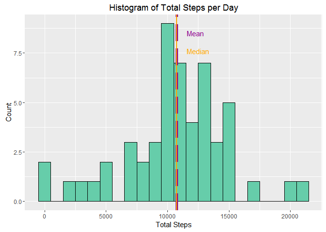
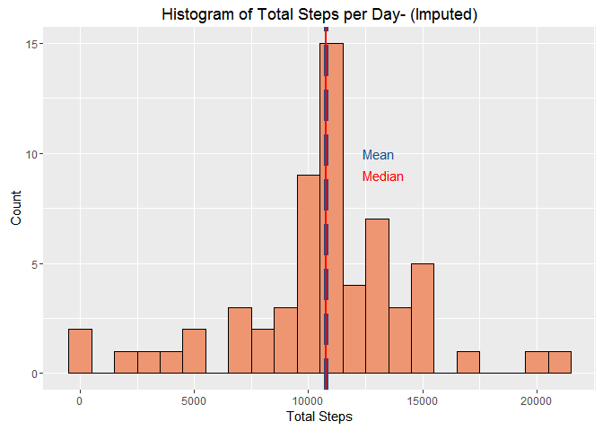

# PA1_template
Erin Stein  
December 5, 2016  


## R Markdown for Reproducible Research: Peer Assessment 1


###Loading and prepocessing the data

Load the necessary packages.


```r
library(dplyr)
```

```
## Warning: package 'dplyr' was built under R version 3.3.2
```

```
## 
## Attaching package: 'dplyr'
```

```
## The following objects are masked from 'package:stats':
## 
##     filter, lag
```

```
## The following objects are masked from 'package:base':
## 
##     intersect, setdiff, setequal, union
```

```r
library(ggplot2)
```

Read in the activity set and confirm the variables by viewing the first few lines. And looking at a summary to determine the class of each variable. Noting that date is classified as a factor, transform it to "date" class.


```r
unzip("activity.zip")
activity <- read.csv("activity.csv")
activity$date <- as.Date(activity$date)
head(activity)
```

```
##   steps       date interval
## 1    NA 2012-10-01        0
## 2    NA 2012-10-01        5
## 3    NA 2012-10-01       10
## 4    NA 2012-10-01       15
## 5    NA 2012-10-01       20
## 6    NA 2012-10-01       25
```

```r
str(activity)
```

```
## 'data.frame':	17568 obs. of  3 variables:
##  $ steps   : int  NA NA NA NA NA NA NA NA NA NA ...
##  $ date    : Date, format: "2012-10-01" "2012-10-01" ...
##  $ interval: int  0 5 10 15 20 25 30 35 40 45 ...
```


###What is the mean total number of steps taken per day?

Group the activity data by date, then use the summarise() function to determine the number of total steps taken each day.


```r
activity_bydate <- group_by(activity, date)
sumsteps <- summarise(activity_bydate, sum(steps))
colnames(sumsteps) <- c("Date", "Total.Steps")
head(sumsteps)
```

```
## # A tibble: 6 × 2
##         Date Total.Steps
##       <date>       <int>
## 1 2012-10-01          NA
## 2 2012-10-02         126
## 3 2012-10-03       11352
## 4 2012-10-04       12116
## 5 2012-10-05       13294
## 6 2012-10-06       15420
```

Plot a histogram of the number of total steps per day.


```r
g <- ggplot(sumsteps, aes(Total.Steps))
g + geom_histogram(colour = "black", fill = "aquamarine3", binwidth = 1000) + 
        labs(title = "Histogram of Total Steps per Day", x = "Total Steps", y = "Count") + 
        geom_vline(xintercept = mean(sumsteps$Total.Steps, na.rm = TRUE), lwd = 2, colour = "darkmagenta", linetype = "longdash") + 
        annotate("text", label = "Mean", x = 12300, y = 8.5, colour = "darkmagenta") + 
        geom_vline(xintercept = median(sumsteps$Total.Steps, na.rm = TRUE), lwd = 1, colour = "orange1") + 
        annotate("text", label = "Median", x = 12500, y = 7.6, colour = "orange1")
```

```
## Warning: Removed 8 rows containing non-finite values (stat_bin).
```

<!-- -->

Calculate the mean and median number of steps taken per day.


```r
meansteps <- mean(sumsteps$Total.Steps, na.rm = TRUE)
print(paste("Mean of", meansteps, "steps taken per day."))
```

```
## [1] "Mean of 10766.1886792453 steps taken per day."
```

```r
mediansteps <- median(sumsteps$Total.Steps, na.rm = TRUE)
print(paste("Median of", mediansteps, "steps taken per day."))
```

```
## [1] "Median of 10765 steps taken per day."
```


###What is the average daily activity pattern?

Begin by grouping the data by interval.


```r
activity_byint <- group_by(activity, interval)
```

Next, use the summarise() function to determine the average step count per interval.


```r
avgsteps_int <- summarise(activity_byint, mean(steps, na.rm = TRUE))
colnames(avgsteps_int) <- c("Interval", "Average.Step.Count")
head(avgsteps_int)
```

```
## # A tibble: 6 × 2
##   Interval Average.Step.Count
##      <int>              <dbl>
## 1        0          1.7169811
## 2        5          0.3396226
## 3       10          0.1320755
## 4       15          0.1509434
## 5       20          0.0754717
## 6       25          2.0943396
```

Use ggplot2 to plot a time series, with the 5-minute intervals on the x-axis and the average number of steps in that interval on the y-axis.


```r
p <- ggplot(avgsteps_int, aes(Interval, Average.Step.Count))
p + geom_line(colour = "dodgerblue3", lwd = 0.8) + 
        labs(title = "Average Step Count per 5-min Interval") +
        labs(x = "5-minute Interval", y = "Average Step Count")
```

<!-- -->

To determine which interval contains the max average step count, use which.max().


```r
maxavgint <- avgsteps_int[which.max(avgsteps_int$Average.Step.Count),]
print(maxavgint)
```

```
## # A tibble: 1 × 2
##   Interval Average.Step.Count
##      <int>              <dbl>
## 1      835           206.1698
```

```r
print(paste("The max average step count of", maxavgint$Average.Step.Count, "occurs during the 5-min interval beginning at", maxavgint$Interval, "am."))
```

```
## [1] "The max average step count of 206.169811320755 occurs during the 5-min interval beginning at 835 am."
```


###Imputing missing values

To calculate the number of rows missing data on step counts, simply sum the number of NA's that occur in the steps column of the original activity data set.


```r
sum(is.na(activity$steps))
```

```
## [1] 2304
```

We'll need to replace these 2304 missing values. Let's do so by replacing them with the entire time period's average step count for the corresponding 5-min intervals. First, join the activity data set with the average step count per interval data set. Then, replace all NA step values with the average interval step count in the new column. Finalize the data set by trimming it back down to the steps, date, and interval columns.


```r
colnames(avgsteps_int) <- c("interval", "steps")
activity2 <- full_join(activity, avgsteps_int, by = "interval")
index <- is.na(activity2$steps.x)
activity2 <- within(activity2, steps.x[index] <- steps.y[index])
activity2 <- select(activity2, steps.x, date, interval)
colnames(activity2)[1] <- "steps"
```

Now to plot a new histogram of the number of steps taken per day using the same group_by() and summarise() tools as before.


```r
activity2_bydate <- group_by(activity2, date)
sumsteps2 <- summarise(activity2_bydate, Total.Steps = sum(steps))
head(sumsteps2)
```

```
## # A tibble: 6 × 2
##         date Total.Steps
##       <date>       <dbl>
## 1 2012-10-01    10766.19
## 2 2012-10-02      126.00
## 3 2012-10-03    11352.00
## 4 2012-10-04    12116.00
## 5 2012-10-05    13294.00
## 6 2012-10-06    15420.00
```

```r
g2 <- ggplot(sumsteps2, aes(Total.Steps))
g2 + geom_histogram(colour = "black", fill = "lightsalmon2", binwidth = 1000) + 
    labs(title = "Histogram of Total Steps per Day- (Imputed)", x = "Total Steps", y = "Count") + 
    geom_vline(xintercept = mean(sumsteps2$Total.Steps, na.rm = TRUE), lwd = 2, colour = "dodgerblue4", linetype = "longdash") + 
    annotate("text", label = "Mean", x = 13100, y = 10, colour = "dodgerblue4") + 
    geom_vline(xintercept = median(sumsteps2$Total.Steps, na.rm = TRUE), lwd = 1, colour = "red") + 
    annotate("text", label = "Median", x = 13300, y = 9, colour = "red")
```

<!-- -->

Continue by calculating the new mean and median based off this NA-free data set.


```r
meansteps2 <- mean(sumsteps2$Total.Steps, na.rm = TRUE)
print(paste("Mean of", meansteps2, "steps taken per day."))
```

```
## [1] "Mean of 10766.1886792453 steps taken per day."
```

```r
mediansteps2 <- median(sumsteps2$Total.Steps, na.rm = TRUE)
print(paste("Median of", mediansteps2, "steps taken per day."))
```

```
## [1] "Median of 10766.1886792453 steps taken per day."
```

The impact that imputation has had on the measures of mean and median appears negligible for this data set. The median has increased by about 0.011%.


###Are there differences in activity patterns between weekdays and weekends?

Let's first create a new column in the imputed data set that designates the weekday of the observation and then convert that into a factor column with two levels: Weekday and Weekend.


```r
activity2$weekday <- weekdays(activity2$date)
index2 <- activity2$weekday %in% c("Sunday", "Saturday")
activity2 <- within(activity2, weekday[index2] <- "Weekend")
activity2 <- within(activity2, weekday[!index2] <- "Weekday")
activity2$weekday <- as.factor(activity2$weekday)
```

Now to finish with a panel plot displaying the Average Step Count per 5-min interval for the weekend observations vs the weekday observations. Begin by grouping the imputed data by both weekday factor level and interval.


```r
activity2_byint <- group_by(activity2, weekday, interval)
avgsteps_int2 <- summarise(activity2_byint, Avg.Step.Count = mean(steps, na.rm = TRUE))
```

Then, create a multi-panel plot, one for the weekday data, and one for the weekend data, that displays the average step count per 5-min interval during the day.


```r
q <- ggplot(avgsteps_int2, aes(interval, Avg.Step.Count))
q + geom_line(aes(color = weekday), lwd = 0.8) + 
        facet_grid(weekday ~ .) + 
        labs(title = "Average Step Count per 5-min Interval (Imputed)") + 
        labs(x = "5-minute Interval", y = "Average Step Count") + 
        theme(legend.position = "none")
```

<!-- -->

We see that the weekday data has a much higher spike in the average step count in the morning during commuter hours, but that the weekend average step counts are more consistently higher throughout the day. These patterns seem to fit with typical workday vs weekend activity patterns.
